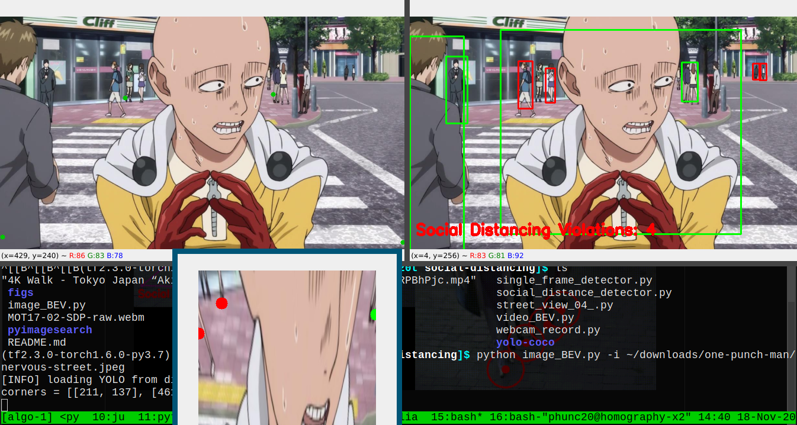

## Origin
Around January 2020, I was implementing this social distancing program that many of us first saw on [Landing.ai's announcement](https://landing.ai/landing-ai-creates-an-ai-tool-to-help-customers-monitor-social-distancing-in-the-workplace/).

At that time, on the Internet there were not many people sharing how exactly they did it. I found two or three github repos, but none of them was satisfying (_Well, strictly speaking, there was one interesting repo which used **OpenPose** and **body part length** to conceive a **two-meter distance**_.).

It was about the same time when [pyimagesearch](https://www.pyimagesearch.com/2020/06/01/opencv-social-distancing-detector/) published an article on the same topic. It was a good article, but it only slightly hinted at how it would further improve in the **bird's-eye view** direction 

## Difficulties
At that time, I only heard of **perspective change** but did not know exactly what it was and how to do it.

The main idea of this repo is simple:
01. Use **YOLO** to obtain bounding boxes on persons
02. Take one representative point from each bounding box (our choice being the **center bottom** point)
03. Use **perspective change** to rectify the plane on which the persons walk in the video, and calculate the distance between transformed representative points

Maybe I will write a small repo on perspective change later. For the moment being, I would just point the interested readers to
- [a fine medium article](https://medium.com/acmvit/how-to-project-an-image-in-perspective-view-of-a-background-image-opencv-python-d101bdf966bc)
- [pyimagesearch's article on perspective change](https://www.pyimagesearch.com/2014/08/25/4-point-opencv-getperspective-transform-example/)
- [a decent book titled "Multiple View Geometry in Computer Vision"](https://www.robots.ox.ac.uk/~vgg/hzbook/)

I finished this repo _around February 2020_ and has since not polished it. Sorry for the delay and hope what I shared here may be useful.


## How to use this repo
01. Create a folder named `yolo-coco`
02. Download the configuration and weight files to `yolo-coco` folder
    ```bash
    # from Joseph Redmon's github repo
    curl -o yolo-coco/yolov3.cfg https://raw.githubusercontent.com/pjreddie/darknet/master/cfg/yolov3.cfg
    curl -o yolo-coco/yolov3.weights https://pjreddie.com/media/files/yolov3.weights
    curl -o yolo-coco/coco.names https://github.com/pjreddie/darknet/blob/master/data/coco.names
    ```
Once having all the files for YOLO to run, just run any one of the python scripts according to the usage described
in each file.
- `social_distance_detector.py`, `single_frame_detector.py` are scripts coming from pyimagesearch
- `webcam_record.py` just provides a way to record a video from the webcam
- `street_view_04_.py` is an intermediate test script
- `image_BEV.py`, `video_BEV.py` both produce **Bird's Eye View**, one for image, the other for video
	- These scripts when run will first open up a image window called `Draw` for the user to mark four points on, which correspond to a rectangle in the real world represented by the image. This rectangle is used to construct a perspective change of the ground on which people in the video/image walk.

For those who really get their hand dirty and play with this repo: You might find useful to tweak the parameters inside the script **`pyimagesearch/social_distancing_config.py`**.


## Example results
The following video is downloaded from and credited to [some famous website on MOT](https://motchallenge.net/vis/MOT17-02-SDP).
<br/>


<br/>

And the next one shows an example of how to applying one of the scripts to an image: _Users of this repo should **mark four points** like shown in this screenshot, **clockwisely** or **counter-clockwisely**_

<br/>



